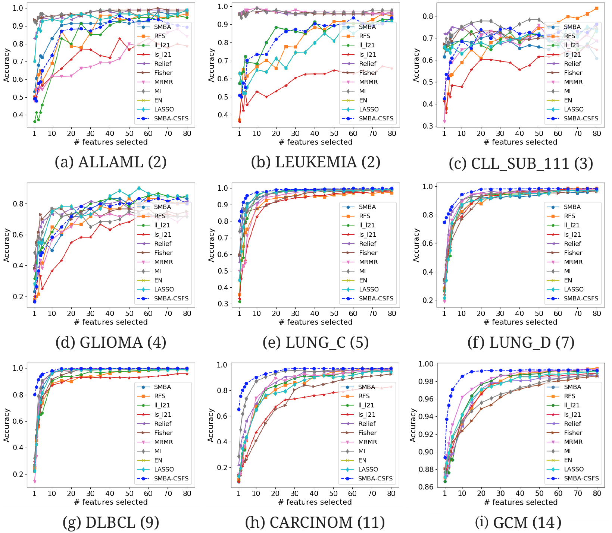
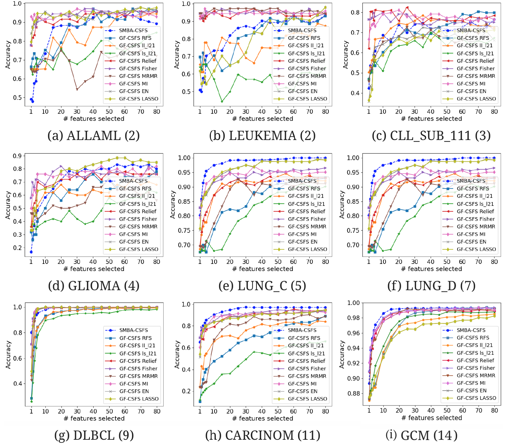

# Background

Feature selection (FS) plays a key role in several scientific fields and in particular computational biology, making it possible to treat models with fewer variables, which in turn are easier to explain and might speed the experimental validation up, by providing valuable insight into the importance and their role. We propose a novel procedure for FS conceiving a two-steps approach. Firstly, a sparse coding based learning technique is used to find the best subset of features for each class of the train set. In doing so, it is assumed that a class is represented by using a subset of features, called **_representatives_** such that each sample, in a specific class, can be described as a linear combination of them.  Secondly, the discovered feature subsets are fed to a class-specific feature selection scheme, to assess the effectiveness of the selected features in classification task. To this end, an ensemble of classifiers is built by training a classifier, one for each class on its own feature subset, i.e., the one discovered in the previous step and, a proper decision rule is adopted to compute the ensemble responses.

# A-Sparse-Coding-Based-Approach-for-Class-Specific-Feature-Selection (SMBA-CSFS)

Feature selection has been widely used for eliminating redundant or irrelevant features and it can be done in two ways: Traditional Feature Selection (TFS) for all classes and Class-Specific Feature Selection (CSFS). CSFS is the process of finding different set of features for each class. In this kind of approach, different methods have been proposed. Conversely from a TFS algorithm, where a single feature subset is selected for discriminating among all the classes in a supervised classification problem, a CSFS algorithm selects a subset of feature for each class. A general framework for CSFS can use any traditional **_feature selector_**, for choosing a possible different subset for each class of a supervised classification problem. Depending on the type of the feature selector, the overall process may slightly change.

Sparse-Coding Based Approach for Class-Specific Feature Selection (SMBA-CSFS) is based on the concept of the **_Compressed Sensing_**. Basically, this approach is a joint sparse multiple optimization problem which tries to find a subset of features called **_representative_**, that best reconstruct/represent the entire dataset by linearly combining each retrieved feature component. We try to best represent each class-sample set of the train set by only using few representatives features. 

# Prerequisites and requirements

## Pre-requisites
1. Python 2.7 or greater <br>
2. A CUDA version 5.0 or greater (facoltative). For installing, please refer to the [official CUDA documention](http://docs.nvidia.com/cuda/#axzz4al7PKeAs).

# Requirements
The software is written in Python. In order to correctly work, the software requires the following packages:

- numPy
- sciPy
- sklearn
- hdf5storage
- optiona: pycuda
- optional: skcuda

**NB**: The SMBA class can eventually run faster by exploiting the CUDA environment. In case you cannot install (for some reason) the latter dependencies, you must manually remove the code which depends on these packages.

# Usage

In order to use this algorithm, go into the project folder: `/src` and run the file `CSFS_SMBA.py`.

# Results


`Comparison of several TFS accuracies against SMBA and SMBA-CSFS on nine data sets:
(a)  ALLAML(2), (b) LEUKEMIA(2), (c) CLL_SUB_111(3), (d) GLIOMA(4), (e) LUNG_C(5), (f) LUNG_D(7), (g) DLBCL(9), (h) CARCINOM(11), (i) GCM(14), when a varying number of features is selected. SVM classifier with 5-fold CV was used.`

<hr>


`Comparison of several CSFS accuracies against SMBA-CSFS on nine data sets:
(a)  ALLAML(2), (b) LEUKEMIA(2), (c) CLL_SUB_111(3), (d) GLIOMA(4), (e) LUNG_C(5), (f) LUNG_D(7), (g) DLBCL(9), (h) CARCINOM(11), (i) GCM(14), when a varying number of features is selected. SVM classifier with 5-fold CV was used.`

# Authors

  Davide Nardone, University of Naples Parthenope, Science and Techonlogies Departement, Msc Applied Computer Science
  https://www.linkedin.com/in/davide-nardone-127428102/
  
# Contacts

For any kind of problem, questions, ideas or suggestions, please don't esitate to contact me at: 
- **davide.nardone@studenti.uniparthenope.it**
  
# Papers that cite CSFS-SMBA

If you use the software in a scientific publication, please consider citing the repository with the following DOI:

```
@article{nardone2019sparse,
  title={A Sparse-Modeling based approach for Class-Specific feature selection},
  author={Nardone, Davide and Ciaramella, Angelo and Staiano, Antonino},
  year={2019},
  institution={PeerJ Computer Science}
}
```
  
